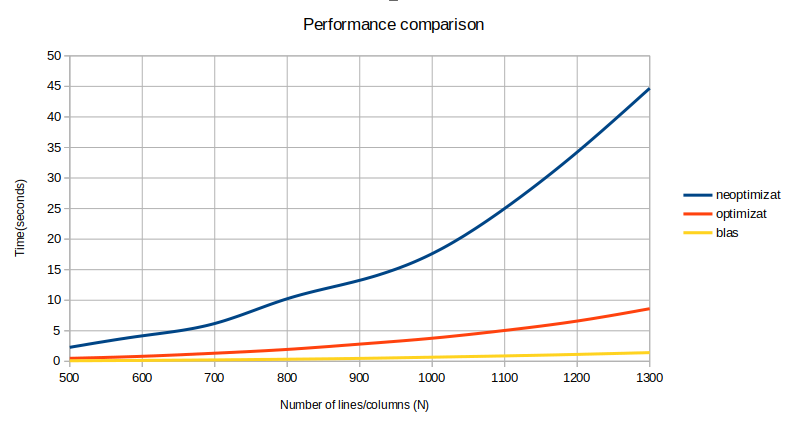

Nume: Paris Cristian-Tanase
Grupă: 331CAb

# Tema <NR> 2 Optimizare de cod

Descrierea solutiilor
-

### Mentiuni preliminare legate de implementare

In cadrul temei ni s-a cerut sa implementam urmatoarea operatie: ``` C = B * A * A_t + B_t * B ```,  unde ```_t```
reprezinta transpusa matricei, ```+``` adunarea matricelor, iar ```*``` inmultirea matricelor. Dupa cum ni s-a cerut si
in enunt, toate implementarile tin cont de faptul ca matricea ```A``` este superior  triunghiulara, iar matricea ```A_t```
este inferior triunghiulara. Totodata, varianta blas mai tine cont si de faptul ca, in urma inmultirii unei matrice
inferior triunghiulare cu transpusa sa rezulta o matrice simetrica. (mai multe detalii legate de implementare gasiti si
in comentariile din cod).

Astfel, in cadrul implementarilor ```solver_neopt```, ```solver_opt```, ordinea inmultirilor este pastrata, dar in cadrul
implementarii ```solver_blas```, mi-am luat libertatea de a schimba putin ordinea primelor inmultiri, pentru a profita
de cele mentionate mai sus si a folosi cat mai multe functii din biblioteca ```blas```. 

Toate calculele si rularile de performanta/memorie/cache au fost rulate **exclusiv** pe partitia Nehalem.

#### solver_neopt

In cadrul solutiei neoptimizate am inmultit matricele in ordinea fireasca, de la stanga la dreapta, grupand rezultatele
doua cate doua.

Ce este de mentionat aici este ca in cadrul inmultirii ```B * A```, for-ul interior este ```0 <= k <= j```, pentru a sari peste
0-urile de sub diagonala principala. Practic, in acest fel vom face mai putine iteratii, ceea ce va duce la o imbunatatire
temporala a programului. 

Similar, pentru cazul cand inmultim cu A_t, cu mentiunea ca transpusa este inferior triunghiulara (0-urile se afla deasupra
diagonalei, iar for-ul interior este ```j <= k <= N```).

Aceste doua observatii sunt importante, deoarece ele servesc drept motiv pentru imposibilitatea interschimbarii for-urilor
in varianta optimizata pentru respectivele inmultiri (al doilea si al treilea for fiind corelate matematic).

Timpii (in secunde) obtinuti pentru varianta ```neoptimizata```, pe partitia Nehalem sunt urmatorii:

```
Run=./tema2_neopt: N=400: Time=1.162775
Run=./tema2_neopt: N=500: Time=2.289176
Run=./tema2_neopt: N=600: Time=4.173420
Run=./tema2_neopt: N=700: Time=6.190847
Run=./tema2_neopt: N=800: Time=10.243203
Run=./tema2_neopt: N=900: Time=13.258637
Run=./tema2_neopt: N=1000: Time=17.626549
Run=./tema2_neopt: N=1100: Time=25.022081
Run=./tema2_neopt: N=1200: Time=34.242733
Run=./tema2_neopt: N=1300: Time=44.690781
```

#### solver_opt_m

In cadrul variantei optimizate, am ales sa folosesc urmatoarele tipuri de optimizari:
* Loop interchange (interschimbarea/ordonarea buclelor)
    1. Ultimul bloc de for-uri se foloseste de aceasta optimizare, deoarece era singurul care nu avea dependente intre
    j si k.
    2. Aceasta optimizare ne asigura de folosirea la maxim a localitatii spatiale in cadrul cache-ului si, ca in cel mai
    rau caz, vom avea parte de cel mult acces secvential la elemente. 
* Optimizarea constantelor
    1. Folosita peste tot in program. 
    2. Se face uz de keyword-ul register care este un hint pentru compilator pentru a tine respectiva valoare intr-un registru
    foarte rapid al procesorului, respectiva valoare fiind foarte des utilizata. Totodata, in acest mod, se mai elimina
    unele accese inutile in cadrul vectorului (de ex. C[i*N + j]).
* Optimizarea accesului la vectori
    1. Folosita peste tot in program.
    2. Ne asiguram astfel ca accesul la elemente se realizeaza prin aritmetica pe baza de pointeri si ca nu sunt facute mai
    multe inmultiri si adunari pentru calcularea adreselor decat este necesar. (putem scoate drept constanta
    operatia initiala de calcul a adresei liniei pentru a n-o mai face de N ori in cadrul loop-ului).

Timpii (in secunde) obtinuti pentru varianta ```optimizata```, pe partitia Nehalem sunt urmatorii:

```
Run=./tema2_opt_m: N=400: Time=0.251858
Run=./tema2_opt_m: N=500: Time=0.488962
Run=./tema2_opt_m: N=600: Time=0.822327
Run=./tema2_opt_m: N=700: Time=1.329453
Run=./tema2_opt_m: N=800: Time=1.948451
Run=./tema2_opt_m: N=900: Time=2.816061
Run=./tema2_opt_m: N=1000: Time=3.781510
Run=./tema2_opt_m: N=1100: Time=5.053730
Run=./tema2_opt_m: N=1200: Time=6.593180
Run=./tema2_opt_m: N=1300: Time=8.614140
```

#### solver_blas

Am facut uz de urmatoarele functii din biblioteca ```blas```:
* ```cblas_dcopy``` - copiere de memorie
* ```cblas_dtrmm``` - inmultire cu matrice triunghiulara
* ```cblas_dsymm``` - inmultire cu matrice simetrica
* ```cblas_dgemm``` - inmultire normala de matrice

Timpii (in secunde) obtinuti pentru varianta ```blas```, pe partitia Nehalem sunt urmatorii:

```
Run=./tema2_blas: N=400: Time=0.046055
Run=./tema2_blas: N=500: Time=0.092893
Run=./tema2_blas: N=600: Time=0.153603
Run=./tema2_blas: N=700: Time=0.235405
Run=./tema2_blas: N=800: Time=0.342682
Run=./tema2_blas: N=900: Time=0.479057
Run=./tema2_blas: N=1000: Time=0.676807
Run=./tema2_blas: N=1100: Time=0.887746
Run=./tema2_blas: N=1200: Time=1.134676
Run=./tema2_blas: N=1300: Time=1.425363
```

Comparatie performante
-


Observam faptul ca, in mod deloc surprinzator, varianta ```blas``` este cea mai rapida, urmata de cea ```optimizata```
si apoi de cea ```neoptimizata```.

In timp, toate variantele au un factor de crestere exponential, desi in cazul primelor doua variante acesta este
cu mult mai mic, iar in cazul ```blas``` pare sa fie chiar logaritmic pentru un set mic de date.

Astfel, varianta ```optimizata``` este in medie de **5 ori mai rapida** decat cea ```neoptimizata```, iar cea ```blas```
de aproximativ **30 de ori**.

Comparatie Cachegrind
-  
Vom lua fiecare sectiune pe rand (se recomanda parcurgerea simultana a fisierelor .cache cu explicatiile de mai jos):

```I refs``` (total number of instruction reads): Observam faptul ca in cazul programului neoptimizat acest numar este
foarte mare, deoarece se fac foarte multe operatii aritmetice in plus, pe care le-am eliminat in mare parte cu optimizarile
legate de eliminarea constantelor si al accesului mai eficient al vectorilor. Varianta blas este cea mai
ok, aceasta utilizand probabil la maxim proprietatile enuntate mai sus. Surprinzator, numarul de  ```instruction misses L1 si L3 cache``` 
este aproape dublu pentru varianta ```blas```, in timp ce pentru variantele ```neopt``` si ```opt_m``` este acelasi, 
ceea ce ne duce cu gandul la faptul ca instructiunile utilizate sunt mult mai complexe.

```D refs``` (data reads): Observam faptul ca programul ```neoptimizat``` are foarte multe accese la data, pe cand
cel ```optimizat``` rezolva aceasta problema prin folosirea localitatii spatiale data de interschimbarea for-urilor(practic
utilizam liniile de date existente deja in cache) si de pastrarea in registrele procesorului a datelor cele mai importante,
reducand astfel numarul de accese la memoria principala. Varianta ```blas``` este de departe cea mai buna si la aceasta
categorie, avand de aproape **30 de ori mai putine** accese la memorie decat varianta ```neoptimizata```, si de aproximativ
**5 ori mai putine** fata de varianta ```optimizata```.

```LL refs``` (Last level cache or L3 for Nehalem): Observam faptul ca varianta ```neoptimizata``` are nevoie de mult
mai multe accese la ultimul nivel de cache pentru date (134 * 10^6), fata de aproximativ ```4 ori mai putine``` 
pentru cea ```optimizata```, lucru datorat refolosirii eficiente a informatiilor existente deja in nivelele inferioare
de cache prin reordonarea for-urilor si accesul la variabile si pointeri des utilizati prin intermediul registrelor.
Desi are de aproape ```16 ori mai putine``` accese la L3 cache decat varianta ```optimizata```(aprox. 2 * 10^6), 
varianta ```blas``` are mult mai multe miss-uri.

```Branches```(salturi conditionate/neconditionate): Lucru ciudat la prima vedere, varianta ```neoptimizata``` si 
cea ```optimizata``` au acelasi numar de branches/mispredicts, datorat faptului ca, in ciuda optimizarilor de 
mai sus, acestea nu elimina verificarile din interiorul buclelor pentru contor(i, j, k) sau salturile indirecte la adrese de
memorie date de pointeri pentru a lua o linie de date/stoca informatii. Totusi, varianta ```blas``` uimeste prin
faptul ca numarul de braches este foarte mic, deoarece in spate biblioteca foloseste pentru anumite operatii loop
unrolling care elimina verificarile conditionate.

#### Observatii suplimentare cache

Am ales sa omit sa prezint cifrele legate de rate-uri, deoarece in cazul unor implementari, acestea sunt la prima vedere
contraintuitive. De exemplu, blas-ul are un mispred. rate mai mare decat ambele variante de mana (1.6% vs 0.4%), dar acest
lucru este datorat faptului ca in acel caz sunt mult mai putine branch-uri, iar numarul de mispred. ajunge sa aiba o pondere
mai mare in cadrul raportului.


Observatii implementare
-

* Consider ca tema a fost utila pentru ca mi-a aratat cat de mult poti sa accelerezi o bucata de cod doar din optimizari
legate strict de folosirea memoriei si de arhitectura sistemului de calcul.
* Nu consider neaparat ca implementarea este naiva, dar sunt sigur ca se putea si mai bine de atat (un speedup mai mare),
prin folosirea, de exemplu, a instructiunilor SSE, AVX sau tehnica BMM (block matrix multiplication), sau folosirea unor
proprietati suplimentare a matricelor sau prin adaugarea unor flag-uri pentru optimizarea calculelor in virgula mobila.
* Intregul enunt a fost implementat.

* Dificulati intampinate: 
  * Folosirea functiilor blas in lipsa unei documentatii actualizate. 
  * Grid-ul facultatii merge ca melcul turbat si tot crapa daca folosesc VSCode.

* Lucruri interesante descoperite pe parcurs:
  * Este mai eficient sa declari registre noi la inceputul functiei decat sa redeclari/refolosesti alte registre.
  * Totusi, daca declari prea multe registre, la un moment dat performanta va incepe sa scada.
  * Am avut performanta mai proasta in cadrul variantei neoptimizate atunci cand am facut prima data inmultirea ```A * A_t```,
  decat in cazul in care am facut prima data ```B * A```. Explicatia este urmatoarea: in primul caz profitam o singura
  data de inmultirea cu o matrice triunghiulara, in timp ce in al doilea caz profitam de doua ori de respectiva proprietate
  si, in consecinta, avem mai putine iteratii.
  * Dcopy din blas nu e neaparat mai bun decat memcpy, pe unele arhitecturi fiind mai lent chiar.
  * Documentatia Blas de pe site-ul Apple e mai buna decat cea originala.
  * In cadrul Blas nu prea a contat folosirea dsymm sau dtrmm in ceea ce priveste timpii de rulare.

Resurse utilizate
-

* [Enunt tema 2](https://ocw.cs.pub.ro/courses/asc/teme/tema2)
* [Lab 4](https://ocw.cs.pub.ro/courses/asc/laboratoare/04)
* [Lab 5](https://ocw.cs.pub.ro/courses/asc/laboratoare/05)
* [Lab 6](https://ocw.cs.pub.ro/courses/asc/laboratoare/06)
* [Sortare vector ordonat](https://stackoverflow.com/questions/11227809/why-is-processing-a-sorted-array-faster-than-processing-an-unsorted-array)
* [Triangular matrix](https://en.wikipedia.org/wiki/Triangular_matrix)
* [Symmetric matrix](https://en.wikipedia.org/wiki/Symmetric_matrix)
* [Valgrind documentatie](https://valgrind.org/docs/manual/cg-manual.html)
* [Cachegrind](https://valgrind.org/docs/manual/cg-manual.html)
* [Blas documentatie](http://www.netlib.org/blas/)
* [Blas documentatie Apple](https://developer.apple.com/documentation/accelerate/blas)
* [Dcopy vs memcpy](https://github.com/xianyi/OpenBLAS/issues/45)
* [Dcopy](https://www.ibm.com/docs/en/essl/6.2?topic=subprograms-scopy-dcopy-ccopy-zcopy-copy-vector#am5gr_hscopy)
* [Register keyword](https://www.geeksforgeeks.org/understanding-register-keyword/)
* [Loop interchange](https://en.wikipedia.org/wiki/Loop_interchange)
